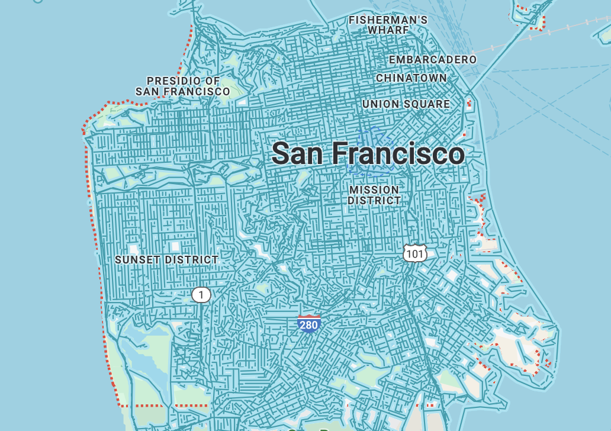

```{r setup, include=FALSE, message=FALSE}
library(tidyverse)
library(ggplot2)
library(dplyr)
library(rsample)
library(here)
library(shiny)
library(forcats)
library(lubridate)
library(flexdashboard)
library(shiny)
library(randomForest)
library(RColorBrewer)
```

# About

## Column {data-width="280"}

### Purpose

This dashboard is exploring the different interesting features of the trees planted in San Francisco from 1955 to 2010.

Author: Christiana Liu

### Data source

Original location of the data: <https://github.com/rfordatascience/tidytuesday/blob/master/data/2020/2020-01-28/sf_trees.csv>

## Column {data-width="720"}

### Navigation Video

<iframe width="720" height="480" src="https://www.youtube.com/embed/rCTDW3NdkBQ" frameborder="0" allowfullscreen>

</iframe>

# Data

**Data:** TidyTuesday 2020/01/28 San Francisco Tree.

This dataset explores the difference species of trees and the legal status, site, address, etc. of them in San Francisco. The data is gathered by San Francisco Department of Legal Work. The table below gives an overview of this dataset.

```{r data table}
# tests if a directory named "data" exists locally
if (!dir.exists(here("data"))) {
    dir.create(here("data"))
}
#tuesdata <- tidytuesdayR::tt_load("2020-01-28")
#sf_trees <- tuesdata$sf_trees
if (!file.exists(here("data", "tuesdata_sf_trees.RDS"))) {
    tuesdata <- tidytuesdayR::tt_load("2020-01-28")
    sf_trees <- tuesdata$sf_trees

    # save the files to RDS objects
    saveRDS(tuesdata$sf_trees, file = here("data", "tuesdata_sf_trees.RDS"))
}
#load the data
sf_trees <- readRDS(here("data", "tuesdata_sf_trees.RDS"))
sf_trees %>% 
  arrange(tree_id) %>% 
  head(100) %>% 
  select(tree_id,legal_status, site_order, site_info, species, address, caretaker,date, latitude, longitude) %>% 
  DT::datatable()
```

# Mapping Trees

## Chart 1 {.tabset}

### Mapping trees in SF by legal status

```{r load data, message = FALSE, echo = FALSE}

trees_df <- sf_trees %>%
  mutate(
    legal_status = case_when(
      legal_status == "DPW Maintained" ~ legal_status,
      TRUE ~ "Other"),plot_size = parse_number(plot_size)) %>%
  select(-address) %>%
  select(-species) %>%
  na.omit() %>%
  mutate_if(is.character, factor)

trees_df %>%
  ggplot(aes(longitude,latitude, color = legal_status)) +
  geom_point(size = 0.3, alpha = 0.6) + 
  labs(
    title = 'Distribution of Trees by Legal Status',  
    subtitle = 'San Francisco Trees',  
    caption = "Data source: TidyTuesday 20200128",
    x = 'Longitude',  
    y = 'Latitude',  
    color = 'Legal Status'  
  ) +
  theme_minimal(base_size = 12) + 
  theme(
    legend.position = 'right',  
    plot.title = element_text(face = "bold", hjust = 0.5), 
    plot.subtitle = element_text(hjust = 0.5)  
  ) +
  scale_color_brewer(palette = "Set2")

```

### Comparative Analysis of Tree Positions

```{r comparitive analysis, warning=FALSE}

sf_trees %>%
  select(tree_id, latitude, longitude) %>%
  gather(measure, value, -tree_id) %>%
  ggplot(aes(1, value)) +
  geom_boxplot(aes(fill = measure), outlier.colour = "sandybrown") +  
  scale_y_continuous(n.breaks = 30) +
  facet_wrap(~ measure, scales = "free_y") +
  labs(
    title = "Distribution of Latitude and Longitude for Trees",
    subtitle = "Comparative Analysis of Tree Positions in San Francisco",
    caption = "Data source: TidyTuesday 20200128",
    x = "Geographic Coordinate",
    y = "Value") + 
  theme_minimal(base_size = 12) +
  theme(
    strip.background = element_rect(fill = "palegreen3"),
    strip.text.x = element_text(size = 10, color = "black", face = "bold"),
    plot.title = element_text(face = "bold", hjust = 0.5),
    axis.ticks.x = element_blank(),
    panel.grid.major = element_blank(),
    #panel.grid.minor = element_blank(),
    legend.position = "none"
  )

```

## Chart 2

### San Francisco Map by Street

{width="317"}

# Tree Species

## Column {.sidebar}

Examine different species of trees in SF

```{r sidebar}
selectInput("variable", "Tree Species:",
                  c("Brisbane Box", "Cherry Plum","Hybrid Strawberry Tree", "Indian Laurel Fig Tree 'Green Gem'","New Zealand Xmas Tree", "Southern Magnolia","Swamp Myrtle", "Sycamore: London Plane","Victorian Box", "Others"))
```

## Column

### Tree species counts in SF by caretaker

```{r clean tree species}
species <- sf_trees %>% 
  arrange(tree_id) %>% 
  select(tree_id, legal_status, site_order, site_info, species, address, caretaker, date, latitude, longitude) %>%
  mutate(species = str_replace(species, ".*::\\s*", "")) %>%
  mutate(species = as.factor(species)) %>%
  mutate(species = fct_lump_n(species, n = 10, other_level = "Others")) %>%
  mutate(caretaker = as.factor(caretaker)) %>%
  mutate(caretaker = fct_lump_n(caretaker, n = 5, other_level = "Others")) %>%
  drop_na()
colors <- RColorBrewer::brewer.pal(10, "Pastel2")


renderPlot({
  filtered_data <- species
  if (input$variable != "Others") {
    filtered_data <- filtered_data %>%
      filter(species == input$variable)
  } else {
    allowed_species <- c("Brisbane Box", "Cherry Plum", "Hybrid Strawberry Tree", 
                         "Indian Laurel Fig Tree 'Green Gem'", "New Zealand Xmas Tree", 
                         "Southern Magnolia", "Swamp Myrtle", "Sycamore: London Plane", 
                         "Victorian Box")
    filtered_data <- filtered_data %>%
      filter(!(species %in% allowed_species))
  }
  caretaker_counts <- filtered_data %>%
    group_by(caretaker) %>%
    summarise(count = n())

  ggplot(caretaker_counts, aes(x = caretaker, fill = caretaker, y = count)) +
    geom_bar(stat = "identity") +
    scale_fill_manual(values = colors) + 
    theme_minimal() +
    labs(title = paste("Count of Trees by Caretaker -", input$variable),
         x = "Caretaker",
         y = "Count of Trees")
})

```

# Tree Years

## Column {.sidebar}

To see the trees planted by years

```{r}
sliderInput("slider", "Year range", min = 1955, max = 2020, value = c(1955, 2020))
```

## Column

### Showing tree planted counts by years

```{r tree years}
sf_trees$year <- year(sf_trees$date)
trees <- reactive({
  sf_trees %>% 
    filter(year >= input$slider[1] & year <= input$slider[2]) %>%
    group_by(year) %>%
    count()
})

renderPlot({
  ggplot(trees(), aes(year, n)) +
    geom_line(color = "#9467bd") +
    labs(title = "Trees planted by years",
        subtitle = "Trend in SF",
        x = "Year",
        y = "Counts") +
    theme_minimal() +
    theme(text = element_text(color = '#17becf'),
          plot.title = element_text(size = 40, face = "bold"),
          plot.subtitle = element_text(size = 24),
          axis.text.x = element_text(size = 14),  
          axis.text.y = element_text(size = 14), 
          panel.grid.major.x = element_blank(), 
          panel.grid.minor.x = element_blank())
}, height = 600)
```

# Tree Legal Status

## Chart 1

### Mapping Tree Legal Status in SF

```{r tree legal status}
sf_trees %>%
  count(legal_status, caretaker) %>%
  add_count(caretaker, wt = n, name = "caretaker_count") %>%
  filter(caretaker_count > 50) %>%
  mutate(legal_status = as.factor(legal_status)) %>%
  mutate(legal_status = fct_lump_n(legal_status, n = 5, other_level = "Others")) %>%
  mutate(caretaker = as.factor(caretaker)) %>%
  mutate(caretaker = fct_lump_n(caretaker, n = 5, other_level = "Others")) %>%
  drop_na() %>%
  group_by(legal_status) %>%
  mutate(percent_legal = n / sum(n)) %>%
  ggplot(aes(percent_legal, caretaker, fill = legal_status)) +
  geom_col(position = "dodge") +
  labs(
    title = "Proportion of Trees by Legal Status and Caretaker",
    subtitle = "Considering only caretakers managing over 50 trees",
    caption = "Data source: TidyTuesday 20200128",
    x = "% of Trees in Each Category",
    y = "Caretaker",
    fill = "Legal Status"
  ) +
  theme_minimal(base_size = 12) +
  theme(
    legend.position = "right",
    plot.title = element_text(face = "bold", hjust = 0.5),
    plot.subtitle = element_text(hjust = 0.5)
  ) +
  scale_fill_brewer(palette = "Set2")

```

## Chart 2

### Random Forest Model


# Analysis

## Column

Question aim: To explore different interesting features of the trees planted in San Francisco.

Data: TidyTuesday 2020/01/28 San Francisco Tree. This dataset explores the difference species of trees and the legal status, site, address, etc. of them in San Francisco. The data is gathered by San Francisco Department of Legal Work.

Data dictionary: <https://github.com/rfordatascience/tidytuesday/tree/master/data/2020/2020-01-28#data-dictionary>

Data: <https://github.com/rfordatascience/tidytuesday/blob/master/data/2020/2020-01-28/sf_trees.csv>

```{r data import, echo = FALSE, warning = FALSE}
trees_df <- sf_trees %>%
  mutate(
    legal_status = case_when(
      legal_status == "DPW Maintained" ~ legal_status,
      TRUE ~ "Other"),plot_size = parse_number(plot_size)) %>%
  select(-address) %>%
  select(-species) %>%
  na.omit() %>%
  mutate_if(is.character, factor)
```

**Distribution of Trees by Legal Status**

```{r exploratory data analysis,fig.width=7, fig.height=6}
trees_df %>%
  ggplot(aes(longitude, latitude, color = legal_status)) +
  geom_point(size = 0.3, alpha = 0.6) + 
  labs(
    title = 'Distribution of Trees by Legal Status',  
    subtitle = 'San Francisco Trees',  
    caption = "Data source: TidyTuesday 20200128",
    x = 'Longitude',  
    y = 'Latitude',  
    color = 'Legal Status'  
  ) +
  theme_minimal(base_size = 12) + 
  theme(
    legend.position = 'right',  
    plot.title = element_text(face = "bold", hjust = 0.5), 
    plot.subtitle = element_text(hjust = 0.5)  
  ) +
  scale_color_brewer(palette = "Set2")
```

**Proportion of Trees by Legal Status and Caretaker**

```{r data analysis 2,fig.width=7, fig.height=6}
trees_df %>%
  count(legal_status, caretaker) %>%
  add_count(caretaker, wt = n, name = "caretaker_count") %>%
  filter(caretaker_count > 50) %>%
  group_by(legal_status) %>%
  mutate(percent_legal = n / sum(n)) %>%
  ggplot(aes(percent_legal, caretaker, fill = legal_status)) +
  geom_col(position = "dodge") +
  labs(
    title = "Proportion of Trees by Legal Status and Caretaker",
    subtitle = "Considering only caretakers managing over 50 trees",
    caption = "Data source: TidyTuesday 20200128",
    x = "% of Trees in Each Category",
    y = "Caretaker",
    fill = "Legal Status"
  ) +
  theme_minimal(base_size = 12) +
  theme(
    legend.position = "right",
    plot.title = element_text(face = "bold", hjust = 0.5),
    plot.subtitle = element_text(hjust = 0.5)
  ) +
  scale_fill_brewer(palette = "Set2")

```

**Distribution of Latitude and Longitude for Trees**

```{r data analysis 3,warning=FALSE,fig.width=7, fig.height=6}

sf_trees %>%
  select(tree_id, latitude, longitude) %>%
  gather(measure, value, -tree_id) %>%
  ggplot(aes(1, value)) +
  geom_boxplot(aes(fill = measure), outlier.colour = "sandybrown") +  
  scale_y_continuous(n.breaks = 30) +
  facet_wrap(~ measure, scales = "free_y") +
  labs(
    title = "Distribution of Latitude and Longitude for Trees",
    subtitle = "Comparative Analysis of Tree Positions in San Francisco",
    caption = "Data source: TidyTuesday 20200128",
    x = "Geographic Coordinate",
    y = "Value") + 
  theme_minimal(base_size = 12) +
  theme(
    strip.background = element_rect(fill = "palegreen3"),
    strip.text.x = element_text(size = 10, color = "black", face = "bold"),
    plot.title = element_text(face = "bold", hjust = 0.5),
    axis.ticks.x = element_blank(),
    panel.grid.major = element_blank(),
    #panel.grid.minor = element_blank(),
    legend.position = "none"
  )

```

**Summary**

In summary, from the first plot, we can see that DPW maintained trees appeared to be in more order. They are planted by the streets of San Francisco. From the second plot, we can see that most of these trees' caretaker is private, interestingly, some of the DPW maintained trees' caretaker is not DPW. From the third plot, we can see the median latitude of the trees is around 38, the longitude is around -122.5, both with a few outlier. Our random forest model predicts from the Tree Legal Status tab shows which trees are maintained by the San Francisco Department of Public Works (DPW) by using random forest. After adjusting for the parameters, I found the best model for fitting, with a testing error rate of 0.092. The last plot shows our model, by using the plot function from the random forest package.
